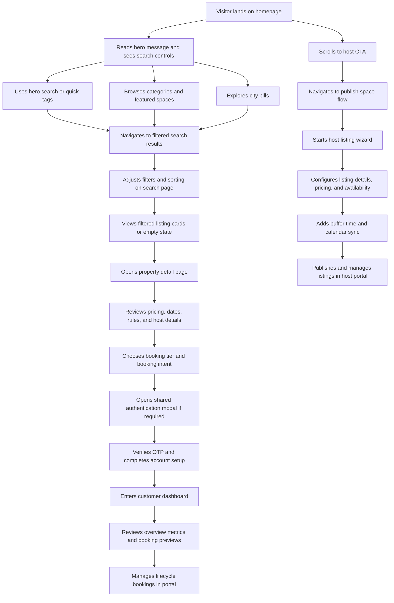

## 1. Product Overview
VenCome needs a high-conversion homepage that positions the platform as a premium commercial space marketplace and guides users from discovery to search with confidence.
- The page targets startups, enterprise teams, event planners, creators, and property owners looking to browse or monetize commercial spaces.
- The homepage must elevate brand trust, highlight flexible booking options, and create clear entry points into search and host acquisition.

## 2. Core Features

### 2.1 Feature Module
1. **Homepage**: premium hero, category discovery, featured inventory, city browsing, platform explanation, host acquisition CTA, trust signals
2. **Search Results Page**: client-side filtering, sorting, active filter tags, map placeholder, reusable listing grid, pagination, mobile filter drawer
3. **Property Detail Page**: premium gallery, booking sidebar, pricing tier selection, inline availability calendar, host profile, reviews, and similar spaces
4. **Authentication Modal**: shared multi-step auth overlay with email OTP, optional registration details, success handoff, and reusable hook controls
5. **Customer Dashboard**: protected portal with persistent sidebar layout, overview metrics, upcoming booking previews, recently viewed spaces, and quick actions
6. **Bookings Portal**: protected bookings management view with lifecycle tabs, search, filters, sorting, and action-oriented booking cards
7. **Host Listings Portal**: performance-focused listing management dashboard with status filters, view toggles, inline actions, and host analytics summaries
8. **Create Space Wizard**: branded multi-step listing wizard covering category, location, details, photos, pricing, availability, buffer time, calendar sync, and preview
9. **Homepage, search, detail, auth, customer portal, and host portal interactions**: inline search controls, horizontal carousels, popovers, animated scroll prompts, URL-driven filter preselection, shared booking state between sections, and responsive navigation handoff to the existing navbar

### 2.2 Page Details
| Page Name | Module Name | Feature description |
|-----------|-------------|---------------------|
| Homepage | Hero Section | Full-screen branded hero with background image, dark overlay, headline, subtitle, inline search bar, quick search tags, and animated scroll indicator |
| Homepage | Category Strip | Horizontally scrollable row of category pills with emojis, hover elevation, hidden scrollbar, and visual fade edges |
| Homepage | Featured Spaces | Horizontal property showcase with arrow-driven scroll, mock listing data, and CTA link to the search page |
| Homepage | Browse by City | Country and region groupings with animated city pills and listing counts linking into pre-filtered search results |
| Homepage | How VenCome Works | Three-step process cards with scroll-triggered motion and clear booking education |
| Homepage | Become a Host | High-contrast conversion section for property owners with stats, CTA, supporting image, and revenue badge |
| Homepage | Trust Signals | Four reassurance blocks explaining verification, escrow, flexibility, and support |
| Search Results | Sticky Filter Sidebar | Multi-group desktop filters with category pills, duration, range slider, capacity, amenities, clear-all action, and apply CTA |
| Search Results | Mobile Filter Drawer | Bottom-sheet version of the filter sidebar with overlay, drag handle, and close-on-apply behavior |
| Search Results | Results Toolbar | Dynamic result count, dismissible active filter pills, sort control, and map toggle |
| Search Results | Map Placeholder Panel | Animated placeholder map module for future backend-driven map integration |
| Search Results | Listing Grid | Responsive reusable listing-card grid using the shared `PropertyCard` component and mock results |
| Search Results | Pagination | Nine-results-per-page pagination with truncation and previous/next controls |
| Search Results | Empty State | Instructional fallback when no spaces match the current filters |
| Property Detail | Photo Gallery | Editorial five-image desktop grid, mobile hero image fallback, and full-screen lightbox with arrows, counter, and swipe support |
| Property Detail | Title and Host Modules | Title metadata, review anchor, verified host card, and contact CTA |
| Property Detail | Content Modules | Expandable description, amenities grid, pricing tiers, inline availability calendar, house rules, location map placeholder, and review summaries |
| Property Detail | Booking Sidebar | Sticky booking card with shared pricing/date state, capacity controls, breakdown totals, and enquiry actions |
| Property Detail | Similar Spaces | Reusable listing-card recommendation row using shared `PropertyCard` data |
| Shared UI | Authentication Modal | Multi-step email OTP modal with OAuth entry buttons, OTP verification, optional registration fields, success state, and reusable open/close hook |
| Customer Portal | Dashboard Layout | Persistent sidebar shell with sticky desktop nav, mobile drawer, top bar, user identity block, and future-ready navigation structure |
| Customer Portal | Overview Dashboard | Welcome banner, summary stats, upcoming bookings preview, recently viewed carousel, and quick actions |
| Customer Portal | My Bookings | Lifecycle tabs, booking search/filter/sort controls, responsive booking cards, and tab-specific empty states |
| Host Portal | My Listings | Host inventory management surface with aggregate metrics, filters, grid/list toggles, dropdown actions, and mock toast feedback |
| Host Portal | Create Space Wizard | Nine-step host onboarding flow with branded progress tracker, mocked form data, buffer controls, calendar connection, and preview/publish stage |

## 3. Core Process
Primary guest journey:
- User lands on the homepage and immediately understands VenCome's commercial focus from the hero copy and premium imagery.
- User chooses a location, timing shortcut, and capacity from the hero search controls or taps a category tag.
- User scrolls to evaluate categories, featured spaces, and city-based browsing options before navigating to `/search`.
- User gains additional trust through the process explanation and trust bar.
- On the search page, user refines results with category, duration, price, capacity, and amenities filters, can sort results, toggle the map placeholder, and paginate through matching listings.
- On the property detail page, user reviews space imagery, amenities, pricing tiers, availability, host credibility, and reviews before selecting dates and booking intent.
- If authentication is required, user can complete a lightweight modal flow from navbar, booking actions, or protected-route prompts without leaving the current context.
- Once authenticated, user can enter a protected customer portal to review bookings, saved spaces, messages, spending, and booking lifecycle actions.
- Hosts can move from listing creation into a dedicated inventory portal where they manage live, paused, and draft spaces with fast actions and analytics summaries.

Primary host journey:
- Property owner scrolls to the hosting CTA, reviews revenue-oriented benefits, and navigates to `/create-space`.

## 4. User Interface Design
### 4.1 Design Style
- Visual direction: premium editorial marketplace with strong contrast, soft luxury neutrals, and restrained gold accents
- Primary colors: `#0A1628` navy, `#305CDE` gold, `#F8F6F0` warm background, `#111827` text
- Button style: rounded pills and soft-corner cards with elevated shadows and motion-based feedback
- Typography: bold, high-impact hero display paired with clean sans-serif body typography already available in the project
- Layout style: desktop-first stacked storytelling with alternating light and dark bands, wide containers, and horizontal browsing modules
- Icon style: Lucide icons with gold accent treatment; category strip uses clear emojis for fast recognition

### 4.2 Page Design Overview
| Page Name | Module Name | UI Elements |
|-----------|-------------|-------------|
| Homepage | Hero Section | Full-bleed image, dark overlay, centered copy, inline search pill, floating popovers, quick tags, pulse chevron |
| Homepage | Category Strip | Scrollable row, fade edges, compact cards, white surfaces, thin borders, subtle hover shadows |
| Homepage | Featured Spaces | Section header, arrow controls, snap-scrolling listing cards, warm neutral background |
| Homepage | Browse by City | Grouped regional labels, pill links, listing metadata, staggered entrance motion |
| Homepage | How It Works | Three equal cards, numeric hierarchy, icon badges, instructional copy, fade-up motion |
| Homepage | Become a Host | Split layout, dark theme, strong typographic contrast, image with earnings badge, dual CTA treatment |
| Homepage | Trust Signals | Evenly spaced reassurance modules with dividers and icon-led hierarchy |
| Search Results | Filter Sidebar | Sticky white filter card with grouped controls, custom slider thumbs, checkbox rows, and gold apply button |
| Search Results | Toolbar | Desktop split bar with result count, active filter pills, sort select, and map toggle |
| Search Results | Map Placeholder | Navy panel with icon-led placeholder messaging and animated reveal |
| Search Results | Listing Grid | Responsive 3/2/1 column grid of reusable listing cards with staggered entrance motion |
| Search Results | Mobile Drawer | Bottom-sheet filter experience with dark overlay and floating trigger button |
| Search Results | Empty State and Pagination | Centered fallback messaging and compact rounded pagination controls |
| Property Detail | Gallery and Lightbox | Five-image asymmetric gallery, floating show-all button, immersive dark lightbox, and gesture-friendly mobile behavior |
| Property Detail | Main Content Rail | Premium stacked information sections with dividers, balanced typography, and scroll-triggered reveal |
| Property Detail | Booking Rail | Elevated sticky booking module with compact tier pills, date summary, capacity controls, and animated totals |
| Property Detail | Reviews and Similar Spaces | Editorial review summary, expandable review cards, and reusable listing recommendations |
| Shared UI | Authentication Modal | Polished overlay-to-sheet auth experience with OTP boxes, OAuth buttons, registration role cards, and animated success handoff |
| Customer Portal | Dashboard Layout | Dark fixed sidebar, compact mobile drawer, utility top bar, and warm neutral content surface |
| Customer Portal | Overview Dashboard | High-contrast greeting banner, metric cards, booking preview stack, reusable property carousel, and utility action grid |
| Customer Portal | My Bookings | Tabbed lifecycle navigation, compact utility toolbar, editorial booking cards, action bar states, and contextual empty messaging |
| Host Portal | My Listings | Dense but polished management view with performance stat strip, inventory cards, quick actions, and dropdown utilities |
| Host Portal | Create Space Wizard | Elevated white form card, sticky numbered progress rail, guided step transitions, contextual helper panels, and a clear publish CTA |

### 4.3 Responsiveness
- Desktop-first design with full-width storytelling sections and generous spacing
- Tablet adapts horizontal sections while preserving search usability and CTA visibility
- Mobile stacks complex layouts vertically, keeps tap targets large, hides overflow scrollbars, and preserves the existing mobile navbar behavior
- Hero search condenses into vertically manageable segments while keeping the search action prominent
- Search results shift to a single-column content flow on mobile, hide the sticky sidebar, and expose filters through a fixed floating drawer trigger
- Property detail collapses the gallery to a single hero image on mobile, moves booking below the content stack, and exposes a fixed bottom booking bar for quick conversion
- Authentication modal centers as a card on desktop and becomes a bottom sheet on mobile while preserving the same step flow and focus management
- Customer dashboard keeps the sidebar sticky on desktop, converts it into a slide-in drawer on mobile, and preserves a fixed utility top bar for page title and notifications
- Host portal reuses the dashboard shell where appropriate and keeps the creation wizard readable on mobile by collapsing the progress rail into a compact step summary
