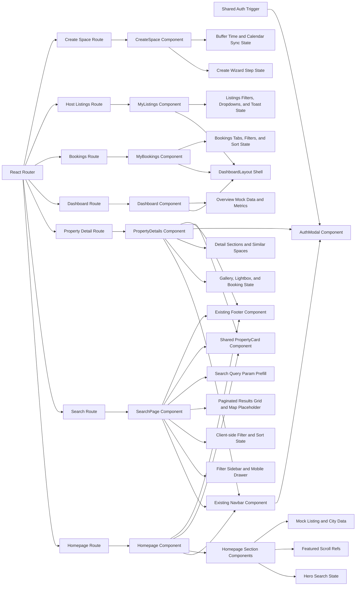

## 1. Architecture Design


## 2. Technology Description
- Frontend: React + JSX + Vite + Tailwind CSS + Framer Motion + Lucide React
- Routing: React Router existing project routes
- State handling: local component state with `useState`, `useMemo`, and `useRef`
- Data source: static mock arrays inside `Homepage.jsx` for featured spaces, categories, city groups, and hero interactions
- Data source: static mock arrays inside page files for homepage, search results, property details, reviews, and similar spaces
- Styling strategy: Tailwind utility classes with inline brand values using arbitrary color tokens where needed

## 3. Route Definitions
| Route | Purpose |
|-------|---------|
| `/` | VenCome homepage with discovery, search entry points, and host conversion content |
| `/search` | Destination for quick tag links, city links, and featured inventory CTA |
| `/property/:id` | Mocked property detail destination with premium imagery, booking flow, and similar space recommendations |
| `/dashboard` | Protected customer overview dashboard with shared sidebar shell |
| `/dashboard/bookings` | Protected bookings management page using the shared dashboard layout |
| `/host/listings` | Protected host inventory management page using the shared portal shell |
| `/host/create` | Protected host listing creation wizard |
| `/create-space` | Destination for property owner CTA in the hosting section |

## 4. Component Definitions
| Component | Responsibility |
|-----------|----------------|
| `Homepage` | Composes all homepage sections and shared mock data |
| `HeroSection` | Renders full-screen hero, inline search, quick filters, and popovers |
| `CategoryStrip` | Renders horizontally scrollable category cards with fade edges |
| `FeaturedSpaces` | Renders featured property cards in a snap-scrolling carousel with arrow controls |
| `BrowseByCity` | Renders regional city link groups with animated city pills |
| `HowItWorks` | Renders animated education cards for the booking flow |
| `BecomeAHost` | Renders owner acquisition CTA with media and stats |
| `TrustSignals` | Renders reassurance modules in a responsive grid |
| `SearchPage` | Owns search params, filters, sorting, pagination, map visibility, and responsive results layout |
| `FilterSidebar` | Pure presentational filter module shared between desktop sidebar and mobile drawer |
| `PropertyCard` | Reusable listing card rendered by both homepage and search page |
| `PropertyDetails` | Owns mocked property detail data, pricing/date selection state, review reveal toggles, and responsive booking behavior |
| `PhotoGallery` | Internal property detail gallery module with lightbox state and mobile fallback |
| `BookingSidebar` | Internal property detail booking summary that consumes shared selected tier and date range state |
| `AuthModal` | Shared controlled overlay that handles entry, email OTP, registration details, and success handoff |
| `useAuthModal` | Small convenience hook that exposes modal open and close controls to consuming components |
| `DashboardLayout` | Shared customer portal shell with sidebar navigation, mobile drawer, and reusable top bar |
| `Dashboard` | Customer overview page with metrics, upcoming booking previews, recently viewed spaces, and quick actions |
| `MyBookings` | Customer bookings page with lifecycle tabs, filtering, sorting, and contextual action cards |
| `MyListings` | Host inventory page with aggregate stats, status filters, grid/list modes, dropdown actions, and publish state controls |
| `CreateSpace` | Host listing wizard with branded progress indicator, mocked listing form state, buffer time controls, calendar sync, and preview/publish handling |

## 5. Interaction Model
- Hero location input uses local text state and a lightweight popover for suggested timing shortcuts and capacity controls.
- Featured spaces carousel uses a `useRef` scroll container and scrolls by 340 pixels on arrow click.
- Section entrance animations use Framer Motion `initial`, `whileInView`, `viewport`, and `transition` patterns shared across sections.
- City pills and process cards use staggered delays to create a refined editorial reveal.
- Search page reads initial `city` and `category` values from URL params and pre-populates filter state on first render.
- Search page filters mock results client-side by categories, duration, price, and optional city/location matching, then applies sorting and pagination.
- Desktop uses a sticky sidebar; mobile exposes the same controls through an animated bottom drawer with overlay dismissal.
- Active filter pills and the map placeholder use `AnimatePresence` for smooth add/remove and expand/collapse transitions.
- Property detail uses mocked data regardless of route param for now while still reading `id` for future backend compatibility.
- Property detail keeps selected pricing tier, date range, capacity, calendar month, lightbox index, and review/description expansion state in the page component and shares the relevant booking state with the sidebar.
- Lightbox interactions use `AnimatePresence`, directional navigation controls, and mobile drag gestures for image switching.
- Inline availability and booking totals are derived from the same selected tier and date range to keep the content rail and booking rail in sync.
- Auth modal is controlled via `isOpen` and `onClose` props, traps focus on open, closes on `Escape`, and can be triggered from navbar actions, booking CTAs, or protected-route interception.
- Auth flow uses local step state for entry, email OTP, phone/email registration details, and success handoff, with simulated async transitions for the mocked phase.
- Dashboard layout uses `useLocation` to detect active navigation state, keeps desktop sidebar sticky, and exposes the same navigation in a mobile slide-in drawer.
- Dashboard overview renders mocked metrics, bookings, actions, and recently viewed spaces with staggered motion for fast perceived performance.
- My bookings owns the active lifecycle tab, text search, status chip filtering, and date sorting locally, then derives the visible booking list client-side from mocked booking data.
- My listings owns status filtering, view mode switching, sort selection, dropdown visibility, delete confirmation state, and a temporary toast for copy-link feedback.
- Create space uses a mocked nine-step wizard state machine and keeps buffer time, calendar provider connections, and preview data in local component state while preserving a polished host onboarding flow.

## 6. Data Model
### 6.1 Frontend View Model
```js
featuredSpace = {
  id: number,
  title: string,
  location: string,
  category: string,
  price: number,
  priceUnit: string,
  rating: number,
  reviewCount: number,
  badge: string | null,
  image: string
}

cityGroup = {
  label: string,
  cities: Array<{
    name: string,
    count: number
  }>
}

searchListing = {
  id: number,
  title: string,
  location: string,
  category: string,
  price: number,
  priceUnit: string,
  rating: number,
  reviewCount: number,
  badge: string | null,
  image: string
}

propertyDetail = {
  id: string,
  title: string,
  location: string,
  category: string,
  capacity: number,
  rating: number,
  reviewCount: number,
  badge: string | null,
  description: string,
  images: string[],
  amenities: Array<{ label: string, icon: string }>,
  pricing: Array<{ unit: string, price: number, label: string, min: string }>,
  rules: string[],
  location_detail: { lat: number, lng: number, description: string }
}

authModalState = {
  step: "entry" | "email-otp" | "phone-otp" | "register-details" | "success",
  email: string,
  otp: string[],
  resendCountdown: number,
  firstName: string,
  lastName: string,
  company: string,
  phone: string,
  role: "customer" | "host"
}

dashboardBooking = {
  id: number,
  tab: "upcoming" | "current" | "past" | "cancelled",
  space: string,
  location: string,
  category: string,
  image: string,
  checkIn: string,
  checkOut: string,
  duration: string,
  durationLabel: string,
  price: number,
  status: string,
  bookingRef: string,
  host: string,
  hostAvatar: string,
  canCancel: boolean,
  canModify: boolean,
  canMessage: boolean
}

hostListing = {
  id: number,
  title: string,
  location: string,
  category: string,
  image: string,
  status: "live" | "paused" | "draft",
  pricing: object,
  stats: { views: number, enquiries: number, bookings: number, revenue: number },
  rating: number | null,
  reviewCount: number,
  capacity: number,
  createdAt: string,
  lastBooked: string | null,
  instantBook: boolean,
  featured: boolean
}
```

### 6.2 Rendering Strategy
- Use the shared `PropertyCard` component as the single visual listing surface across homepage and search page.
- Keep search filters, sort state, pagination state, and mobile drawer state in `SearchPage`, while `FilterSidebar` stays stateless and controlled through props.
- Keep property detail interaction state in `PropertyDetails` and render named internal sections in the same file for fast iteration and shared mocked data access.
- Keep `AuthModal` self-contained inside `src/components` with internal step transitions and exported hook-based visibility control so multiple entry points can reuse the same UX.
- Keep shared customer shell concerns inside `src/layouts/DashboardLayout.jsx`, while `Dashboard.jsx` and `MyBookings.jsx` stay focused on page-specific mocked data and rendering.
- Reuse `DashboardLayout` for host inventory management where it improves consistency, but allow `CreateSpace` to use its own full-width wizard presentation because it is task-focused rather than dashboard-like.
- Preserve the existing `Footer` import and render it unchanged at the bottom of the page.

## 7. Verification Plan
- Run diagnostics for `src/pages/Homepage.jsx`, `src/pages/SearchPage.jsx`, `src/pages/PropertyDetails.jsx`, `src/components/AuthModal.jsx`, `src/layouts/DashboardLayout.jsx`, `src/pages/Dashboard.jsx`, `src/pages/MyBookings.jsx`, `src/pages/MyListings.jsx`, `src/pages/CreateSpace.jsx`, and any touched shared component.
- Run a production build to verify JSX, imports, and Tailwind class usage.
- If a preview server is started, validate homepage, search page, property detail page, authentication modal, customer portal pages, and host portal pages visually, including host listing dropdown actions, toast behavior, step transitions, buffer visualizations, and calendar connection states.
